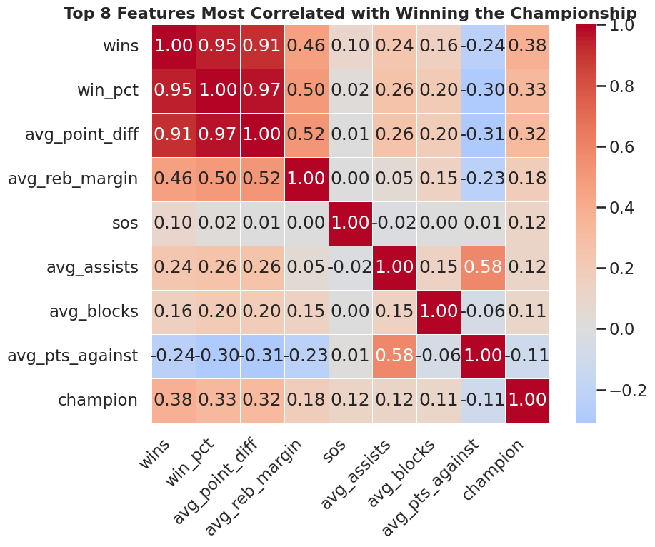
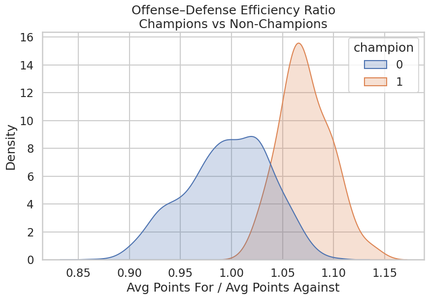
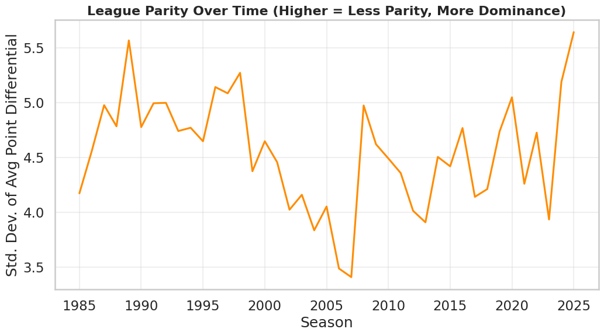
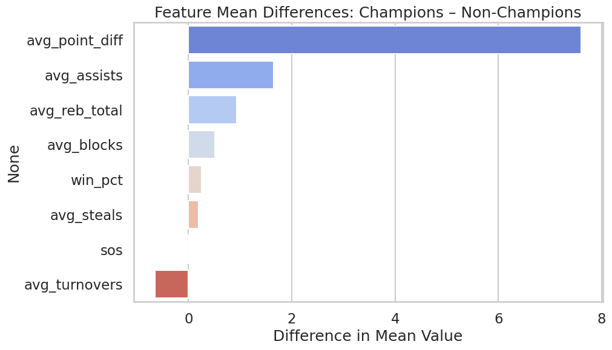

[Midterm Report Video](https://youtu.be/CUzXF3BefUc)

---

# NBA Championship Prediction Project

This project aims to predict whether an NBA team will win the championship in a given season based on historical team statistics from **1985 to 2025**.  
Our workflow involves **data processing**, **feature engineering**, **exploratory data visualization**, and **predictive modeling** using logistic regression, with plans to extend into more complex models.

---

## Data Visualization

For the exploratory analysis portion of this project, we focused on identifying patterns that distinguish championship-winning NBA teams from non-champions and understanding how league competitiveness has evolved over time.  
Rather than producing generic summary plots, we selected visualizations that reveal actionable insights relevant to predicting championships.
The dataset used was of this [Kaggle dataset](https://www.kaggle.com/datasets/eoinamoore/historical-nba-data-and-player-box-scores?select=Games.csv).

---

### Feature Interaction and Correlation Heatmap

The first step was to identify which team statistics correlated most strongly with the likelihood of winning a championship.  
We computed pairwise correlations between all numerical features and then selected the **top eight features** most correlated with the `champion` column, excluding redundant ones like `games` that provide little analytical value.  
This focused heatmap made the relationships interpretable while still capturing the core performance indicators.

The results showed that **`win_pct`**, **`wins`**, and **`avg_point_diff`** had the strongest positive correlations with championships.  
Moderate correlations were observed for **`avg_reb_margin`** and **`avg_assists`**, suggesting that both possession control and teamwork contribute meaningfully to team success.  
Smaller but positive correlations for **`sos`** (strength of schedule) and **`avg_blocks`** implied that stronger opponents and defensive effort might also influence a team’s ability to win titles.

These findings highlighted that consistent dominance across multiple dimensions, rather than one specific metric, characterizes championship teams.

  

---

### Offense–Defense Efficiency Balance

To explore team balance, we engineered a new feature defined as the ratio of a team’s **average points scored to average points allowed**.  
This **efficiency ratio** captures how well a team performs on both sides of the ball.

By plotting kernel density estimates for championship teams versus non-champions, we found a clear separation between the two distributions.  
Champions typically had efficiency ratios between **1.05 and 1.10**, while non-champions clustered near **1.00**.  
In other words, championship teams consistently scored **5–10% more points** than they conceded.

This feature turned out to be a strong indicator of overall dominance and provided evidence that balance between offense and defense is a defining trait of title-winning teams.

  

---

### League Parity and Dominance Over Time

To analyze changes in competitiveness over time, we initially plotted league averages for win percentage and point differential but found those metrics uninformative, as league-wide averages tend to cancel out.  
Instead, we calculated the **standard deviation of team point differentials per season**, which measures how spread out team performances were each year.

A higher standard deviation means greater disparity between top and bottom teams (less parity), while a lower value indicates a more balanced league.

This visualization revealed that the NBA moves through **cycles of dominance and parity**:

- **1980s–1990s:** High variability — dominance from teams like the Lakers, Celtics, and Bulls.  
- **Early 2000s:** More parity and balanced competition.  
- **Late 2010s–2020s:** Increasing disparity — rise of superteams such as the Warriors.

This analysis provided historical context for understanding how external factors (team composition, rule changes, and era effects) influence statistical patterns.

  

---

### Feature Mean Differences Between Champions and Non-Champions

To further quantify how championship teams statistically differ from others, we compared the **mean values of key performance metrics** between the two groups.  
The resulting bar plot displayed the difference in means for several features, with positive bars indicating metrics where champions outperform non-champions.

`Avg_point_diff` again dominated the results, showing that champions outperform other teams by a large margin in average point differential.  
Other notable gaps appeared in **`avg_assists`** and **`avg_reb_total`**, indicating that ball movement and rebounding are key components of sustained success.  
`Avg_turnovers` was negatively associated with championships, suggesting that limiting mistakes is another subtle but important component of winning.

This analysis highlighted a small set of metrics that truly separate championship teams from the rest.

  

---

## Data Processing

We implemented a structured **data-processing workflow** for preparing the NBA team data for modeling and predictive analysis through **data cleaning and integration**, **feature engineering**, and **principal component analysis (PCA)**.

---

### Data Cleaning and Integration

The cleaning and integration process converted raw game-level data into a unified season-level dataset, merging multiple Kaggle and Basketball Reference sources into a single consistent file.

**Key steps:**
- Loaded and standardized raw CSVs (`games`, `team_stats`)  
- Extracted season year and computed win percentages  
- Merged per-game stats with season-level records  
- Aggregated the dataset to one row per team per season  
- Returned a unified dataset via `build_full_dataset()`  

This process resulted in a clean dataset ready for feature engineering and modeling.

---

## Feature Engineering

The feature engineering stage transformed both raw and processed NBA data into a clean, consistent, and informative dataset optimized for championship prediction.  
We began with team-level statistics such as **offensive/defensive rating**, **assist ratio**, **turnover ratio**, **effective field goal percentage (eFG%)**, **true shooting percentage (TS%)**, and **rebounding percentages (ORB%, DREB%)** — providing a complete view of team performance.

**Key steps:**
- Standardized column names and units  
- Removed incomplete records and handled missing values  
- Verified numeric types and corrected formatting errors  
- Normalized features for comparability across eras  

**New engineered features:**
- **Assist-to-Turnover Ratio** — measures ball-handling efficiency  
- **Shooting Efficiency Metrics** — combines eFG% and TS% for scoring effectiveness  
- **Rebounding Strength** — uses ORB% and DREB% to capture possession control  
- **Seasonal Aggregates** — standardized per-game and per-100-possession metrics  

After cleaning and processing, the resulting dataset  
**`data/processed/team_season_features_v2_clean-2.csv`**  
served as the input for modeling experiments, enabling models like Logistic Regression and XGBoost to identify patterns correlated with championship success.

---

## Principal Component Analysis (PCA)

We used PCA to reduce feature redundancy and multicollinearity among performance metrics.  
Since many basketball stats are correlated (e.g., points, assists, rebounds), PCA transformed them into uncorrelated components that preserve most of the variance.

**Implementation details:**
- Preserved **90% of total variance**  
- Represented each team-season as a single row  
- Produced principal components as weighted mixtures of original stats  

This reduced dataset simplified analysis while preserving the structure of team performance.

---

## Modeling Methods

We built two **logistic regression models** using **one-vs-rest encoding** to predict the probability of each NBA team winning the championship in a given season.  
Each model contained **30 binary classifiers** (one per team) predicting the likelihood of that team winning.

We used **Scikit-learn** to split data, train models, and evaluate performance.

---

### Model 1: Temporal Split (1985–2015 → 2016–2025)

- Trains on historical seasons and tests on future data.  
- Simulates realistic forecasting scenarios based on era trends.

---

### Model 2: Random Split (80% Training / 20% Testing)

- Evaluates model generalization across different basketball eras.  
- Tests whether performance trends remain consistent independent of time.

---

### Post-Midterm Report Work

We plan to implement **Random Forests**, **XGBoost**, and potentially a **Neural Network** to capture nonlinear relationships and further improve predictive accuracy.

---

## Preliminary Results

We evaluated both models using three performance metrics:

| **Metric** | **Description** |
|-------------|----------------|
| **ROC-AUC** | Measures how well the model ranks champions above non-champions. |
| **Average Precision (PR-AUC)** | Balances precision and recall; useful for rare events like championships. |
| **Binary Accuracy** | Measures total correct predictions; can be inflated due to class imbalance. |

---

### Model 1: Temporal Split (1985–2015 → 2016–2025)

| **Metric** | **Score** |
|-------------|-----------|
| **ROC-AUC** | 0.9666 |
| **PR-AUC** | 0.5535 |
| **Binary Accuracy** | 0.9633 |
| **Top-1 Accuracy** | 0.7000 |

This model predicted the correct NBA champion **70% of the time**.

---

### Model 2: Random Split (80/20)

| **Metric** | **Score** |
|-------------|-----------|
| **ROC-AUC** | 0.9830 |
| **PR-AUC** | 0.7472 |
| **Binary Accuracy** | 0.9004 |
| **Top-1 Accuracy** | 0.5556 |

This model predicted the correct champion **~55% of the time**.

---

## Summary

The **temporal split model** achieved the strongest results, correctly predicting the NBA champion in **70% of held-out seasons**.  
These results are **promising**, given the rarity of championships and the dataset’s inherent imbalance.  
Future work will involve applying **tree-based models** and **neural networks** to capture nonlinear relationships and enhance predictive performance.

---
