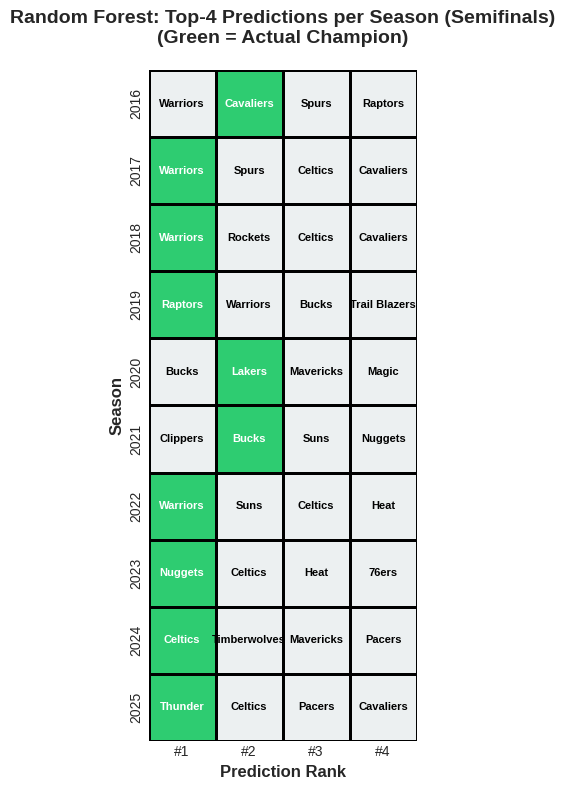
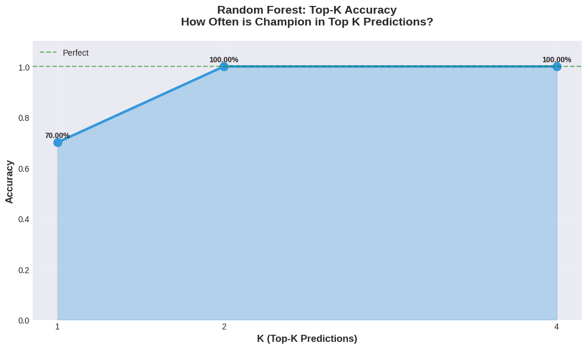

[Midterm Report Video](https://youtu.be/CUzXF3BefUc)
 [Final Report Video](https://youtu.be/fpTjNuiBVdk)

---

# NBA Championship Prediction Project

This project aims to predict whether an NBA team will win the championship in a given season based on historical team statistics from **1985 to 2025**.  
Our workflow involves **data processing**, **feature engineering**, **exploratory data visualization**, and **predictive modeling** using logistic regression, with plans to extend into more complex models.

---

# How to run the Makefile

## 1. Create Virtual Environment + Install Dependencies

This command creates a fresh virtual environment (venv/) and installs everything in requirements.txt:

make install

## 2. Open the Main Notebook (All Models + Visualizations)

To launch the full project notebook:

make 

## 3. Open Only the Neural Network Notebook

If someone wants to run only the softmax neural network:

make nn

---

## Data Processing

We implemented a structured **data-processing workflow** for preparing the NBA team data for modeling and predictive analysis through **data cleaning and integration** and **feature engineering** gathered from this [Kaggle dataset](https://www.kaggle.com/datasets/eoinamoore/historical-nba-data-and-player-box-scores?select=Games.csv).

---

### Data Cleaning and Integration

The raw data used in this project came from multiple Kaggle datasets. These sources contained detailed game-level and team-level statistics, but they were not immediately usable for machine learning.

**The Kaggle data included:**
- Game logs (every regular-season and playoff game)
- Basic and advanced team statistics
- Opponent statistics
- Possession-based efficiency data
- League-wide summary tables

While rich, this data was spread across multiple CSVs, used different naming conventions, and sometimes duplicated the same metrics at game-level and season-level. A major cleaning and integration effort was required to convert these raw files into a single, consistent dataset.

### What the Statistical Terms Mean (Glossary)

To make the dataset interpretable, here are short definitions of the key metrics included in the Kaggle dataset and used in our feature engineering:
- SOS (Strength of Schedule)
Measures how difficult a team’s opponents were on average.
Positive = tougher schedule, negative = easier.
- Offensive Rating (ORtg)
Points scored per 100 possessions — measures scoring efficiency.
- Defensive Rating (DRtg)
Points allowed per 100 possessions — lower is better.
- Net Rating
ORtg − DRtg
One of the strongest predictors of team dominance.
- Pace
Estimated number of possessions per game.
Needed for era normalization.
- eFG% (Effective Field Goal Percentage)
Adjusts FG% to give extra credit for 3-pointers.
- TS% (True Shooting Percentage)
Efficiency metric including 2P, 3P, and free throws.
- ORB% / DRB% (Offensive & Defensive Rebound Percentage)
Measures how many available rebounds a team secures.
- Assist Ratio / Turnover Ratio
Measures ball movement and ball security per 100 possessions.
- Average Point Differential (avg_point_diff)
Points scored minus points allowed per game — one of the most important predictors of championships.

These metrics were originally dispersed and sometimes inconsistent across CSVs, so consolidating and recomputing them was essential.

### Cleaning & Integration Steps (Expanded)
After investigating all raw files, we merged and cleaned the data through the following major steps:
1. Loaded and standardized raw CSVs: 
Converted naming conventions (e.g., “Team” vs “team_name”)
Ensured join keys matched across datasets
Standardized season formats (e.g., “1995–96” → “1996”)
2. Extracted season-level features: 
Computed win percentage, total wins, losses
Aggregated per-game data into per-season summaries
Removed playoff games to ensure training data uses only pre-championship info
3. Merged game statistics with team-level advanced metrics:
Recombined ORtg/DRtg, pace, eFG%, TS%, rebound percentages
Merged opponent-adjusted statistics
Integrated strength-of-schedule tables
4. Consolidated dataset to one row per team per season
This ensured each row corresponds to a single prediction target.
5. Returned final unified dataset

This final dataset contains all raw, engineered, and season-normalized features used by our models.

---

## Data Visualization

For the exploratory analysis portion of this project, we focused on identifying patterns that distinguish championship-winning NBA teams from non-champions and understanding how league competitiveness has evolved over time.  
Rather than producing generic summary plots, we selected visualizations that reveal actionable insights relevant to predicting championships.

---

### Feature Interaction and Correlation Heatmap

The first step was to identify which team statistics correlated most strongly with the likelihood of winning a championship.  
We computed pairwise correlations between all numerical features and then selected the **top eight features** most correlated with the `champion` column, excluding redundant ones like `games` that provide little analytical value.  
This focused heatmap made the relationships interpretable while still capturing the core performance indicators.

The results showed that **`win_pct`**, **`wins`**, and **`avg_point_diff`** had the strongest positive correlations with championships.  
Moderate correlations were observed for **`avg_reb_margin`** and **`avg_assists`**, suggesting that both possession control and teamwork contribute meaningfully to team success.  
Smaller but positive correlations for **`sos`** (strength of schedule) and **`avg_blocks`** implied that stronger opponents and defensive effort might also influence a team’s ability to win titles.

These findings highlighted that consistent dominance across multiple dimensions, rather than one specific metric, characterizes championship teams.

  

---

### Offense–Defense Efficiency Balance

To explore team balance, we engineered a new feature defined as the ratio of a team’s **average points scored to average points allowed**.  
This **efficiency ratio** captures how well a team performs on both sides of the ball.

By plotting kernel density estimates for championship teams versus non-champions, we found a clear separation between the two distributions.  
Champions typically had efficiency ratios between **1.05 and 1.10**, while non-champions clustered near **1.00**.  
In other words, championship teams consistently scored **5–10% more points** than they conceded.

This feature turned out to be a strong indicator of overall dominance and provided evidence that balance between offense and defense is a defining trait of title-winning teams.

  

---

### League Parity and Dominance Over Time

To analyze changes in competitiveness over time, we initially plotted league averages for win percentage and point differential but found those metrics uninformative, as league-wide averages tend to cancel out.  
Instead, we calculated the **standard deviation of team point differentials per season**, which measures how spread out team performances were each year.

A higher standard deviation means greater disparity between top and bottom teams (less parity), while a lower value indicates a more balanced league.

This visualization revealed that the NBA moves through **cycles of dominance and parity**:

- **1980s–1990s:** High variability — dominance from teams like the Lakers, Celtics, and Bulls.  
- **Early 2000s:** More parity and balanced competition.  
- **Late 2010s–2020s:** Increasing disparity — rise of superteams such as the Warriors.

This analysis provided historical context for understanding how external factors (team composition, rule changes, and era effects) influence statistical patterns.

  

---

## Feature Engineering

The feature engineering stage transformed both raw and processed NBA data into a clean, consistent, and informative dataset optimized for championship prediction.  
We began with team-level statistics such as **offensive/defensive rating**, **assist ratio**, **turnover ratio**, **effective field goal percentage (eFG%)**, **true shooting percentage (TS%)**, and **rebounding percentages (ORB%, DREB%)** — providing a complete view of team performance.

**Key steps:**
- Standardized column names and units  
- Removed incomplete records and handled missing values  
- Verified numeric types and corrected formatting errors  
- Normalized features for comparability across eras  

**New engineered features:**
- **Assist-to-Turnover Ratio** — measures ball-handling efficiency  
- **Shooting Efficiency Metrics** — combines eFG% and TS% for scoring effectiveness  
- **Rebounding Strength** — uses ORB% and DREB% to capture possession control  
- **Seasonal Aggregates** — standardized per-game and per-100-possession metrics
- **SOS (Strength of Schedule)** - Measures how difficult a team’s opponents were on average.
Positive = tougher schedule, negative = easier.

After cleaning and processing, the resulting dataset  
**`data/processed/team_season_features_v2_clean-2.csv`**  
served as the input for modeling experiments, enabling models like Logistic Regression and XGBoost to identify patterns correlated with championship success.

### Why We Needed to Feature Engineer the Dataset

The original Kaggle dataset provides raw counts and percentages, but championship prediction requires interpreting team performance relative to the league, not just in isolation.

For example:
- A team scoring 110 points per game means very different things in 1990 versus 2020 because league scoring environments changed dramatically.
- Raw rebound totals don’t reflect pace differences or whether the team actually controlled possession better than its opponents.
- Strength of schedule (SOS) and net rating require calculations across entire seasons, not single games.
  
This step dramatically improved the quality of signals available to the models.

---

### Selecting Temporal Splitting of the Dataset
Random train/test splits allow the model to “cheat” by learning patterns from future seasons.
This is unrealistic because:
- team styles, pace, and scoring change dramatically across eras
- modern teams (2020s) should never influence predictions about the 1990s
- championship frequency is extremely rare—future examples should not leak backward

Thus, to simulate true NBA forecasting, we used:

Training data: 1985–2015  
Test data: 2016–2025

---

## Why We Switched to Ranking Metrics (Top-K Accuracy & PR-AUC)

Predicting a single NBA champion out of 30 teams is not a normal classification problem.

Binary metrics (accuracy, ROC-AUC) are misleading because:
- 29 out of 30 teams are non-champions
- a model can get 97% accuracy by predicting “no champion” for all teams
- ROC-AUC treats all pairs equally, even though only one team matters each season

### To address this, we use ranking metrics:

### Top-K Accuracy (K = 1, 2, 4)
- Top-1: Did the model correctly pick the champion?
- Top-2: Did the model’s “finals” contenders include the champion?
- Top-4: Did the model include the champion in its “semifinals”?

### Average Precision (PR-AUC)

Measures probability concentration on the true champion—perfect for rare-event prediction.

These metrics match playoff structure and reflect realistic forecasting.

---
## Additional Feature Engineering 

To make models era-robust and context-aware, we engineered new features capturing season-relative performance, solving issues caused by changing league averages over decades.

### Season Percentile Rank (feature_season_rank)
Normalizes each stat relative to the league within that season.

Example:
A +6 point differential may be elite in 2004 but average in 2024.
Percentile rank removes era bias.

### Season Z-Score (feature_season_zscore)
Represents how many standard deviations above/below league average a team is.

### Missing Value Handling
Used median imputation to ensure robustness with large feature sets.

### Probability Calibration
Tree-based models (RF, XGBoost) can produce uncalibrated scores.
We applied sigmoid calibration to turn outputs into meaningful probabilities.
These additions improved performance across all models, especially Random Forest and Softmax NN.

## Modeling

To predict the NBA champion using regular-season statistics, we evaluated a set of machine learning models chosen to reflect a range of modeling assumptions and levels of interpretability.  Logistic Regression provided a strong linear baseline and helped establish how far simple decision boundaries could separate champions from non-champions.  Support Vector Machines (SVM) expanded the hypothesis space by allowing more flexible decision surfaces, while a Softmax Neural Network offered a probabilistic framework for ranking all 30 teams simultaneously.  Ensemble tree methods—XGBoost and Random Forest—were included due to their strong performance on structured tabular data, ability to model feature interactions, and robustness in small-sample settings.  All models were evaluated using a temporal train–test split to simulate realistic forward-in-time prediction, ensuring that each season was predicted without access to future information.

Model Comparison (2016–2025 Evaluation)
| **Model**              | **PR-AUC** | **Top-1 Accuracy** | **Top-2 Accuracy** | **Top-4 Accuracy** |
| ---------------------- | ---------- | ------------------ | ------------------ | ------------------ |
| Logistic Regression    | 0.704      | 0.600              | 0.900              | 1.000              |
| SVM (RBF Kernel)       | 0.523      | 0.500              | 0.900              | 1.000              |
| Softmax Neural Network | 0.725      | 0.600              | —                  | —                  |
| XGBoost                | 0.761      | 0.700              | 0.800              | 1.000              |
| **Random Forest**      | **0.834**  | **0.700**          | **1.000**          | **1.000**          |

Random Forest achieved the strongest overall ranking performance, outperforming all other models in Average Precision (PR-AUC) and matching or exceeding them in Top-K accuracy metrics.

## Final Model Selection: Random Forest Classifier

The Random Forest Classifier was selected as the final model due to its strong and consistent performance across all evaluation metrics. Given the relatively small number of seasons available, the numerical structure of the dataset, and the need for stability under temporal evaluation, Random Forests were particularly well suited for this task. The ensemble structure reduces variance across seasons, handles correlated features effectively, and produces reliable ranking scores for all 30 teams. Among all models tested, Random Forest achieved the highest Average Precision and was the only model to obtain perfect Top-2 and Top-4 accuracy.

Season-by-Season Predictions (Random Forest Model)
| **Season** | **Predicted Team** | **Pred Prob** | **True Champion** | **Correct** |
| ---------- | ------------------ | ------------- | ----------------- | ----------- |
| 2016       | Warriors           | 0.521         | Cavaliers         | 0           |
| 2017       | Warriors           | 0.740         | Warriors          | 1           |
| 2018       | Warriors           | 0.484         | Warriors          | 1           |
| 2019       | Raptors            | 0.841         | Raptors           | 1           |
| 2020       | Bucks              | 0.078         | Lakers            | 0           |
| 2021       | Clippers           | 0.044         | Bucks             | 0           |
| 2022       | Warriors           | 0.710         | Warriors          | 1           |
| 2023       | Nuggets            | 0.761         | Nuggets           | 1           |
| 2024       | Celtics            | 0.900         | Celtics           | 1           |
| 2025       | Thunder            | 0.841         | Thunder           | 1           |

### Summary:

Correct in 7 of 10 out-of-sample seasons

Ranked the true champion in the Top-4 every year

Achieved perfect Top-2 and Top-4 accuracy

Most confident correct predictions: 2024 Celtics (0.900) and 2025 Thunder (0.841)

### Visualizations

  
 
  

## 2026 Prediction
Random forest predicted that Thunder would win the 2026 NBA Championship based on the current season data so far. Obviously, a more accurate prediction would be given at the end of the regular season but because of our current time of the year, this is the best we can do. The following are the top 4 predictions:
1. Thunder
2. Pistons
3. Raptors
4. Rockets

## Conclusion & Future Work
- We built numerous NBA championship prediction models using season-level team statistics from 1985-2025
- Implemented temporal train and test splits to ensure realistic forecasting and prevent leakage
- Ranking metrics (Top-K Accuracy, PR-AUC) were effective, since only one team per season is a champion, and standard accuracy is misleading.
- The strongest models correctly identified nearly all true contenders, showing that championships are more predictable than expected when using engineered features and ranking-based evaluation.
- Overall, Random Forest was the best model as it consistently delivered the highest predictive accuracy and precision, while correctly ranking every true champion within the Top-4

  
### For future work, we can:
- incorporate player-level and lineup-level data
- integrate injury and roster transactions
- engineer stronger nonlinear features to capture more data
- simulate playoff brackets rather than single-season predictions
